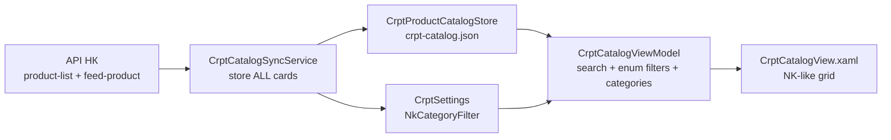

# Задачи — UI каталога CRPT (Национальный каталог)

> **Главная спецификация:** [CRPT_SUZ_INTEGRATION_TASK.md §9.5, §11.2](./CRPT_SUZ_INTEGRATION_TASK.md)  
> **Правила проекта:** [AGENTS.md](../AGENTS.md), [.cursor/rules/wpf-ui.mdc](../.cursor/rules/wpf-ui.mdc)  
> **Как выполнять фазы (solo vs оркестрация):** см. § [Workflow по фазам](#workflow-по-фазам) в конце документа.

---

## ECC vs прежний план (что изменилось)

| Было (старый формат) | Стало (ECC + TASKS.md) |
|----------------------|-------------------------|
| Список целей и файлов одним блоком | **Фазы с зависимостями**, checkbox-задачи, ID подзадач |
| Фильтры «опубликованные/подписанные» на sync | **Явное решение:** sync хранит **все** карточки; фильтры — только UI |
| Общие формулировки «добавить колонки» | **Acceptance criteria**, таблицы маппинга LK ↔ API, verification на фазу |
| Без skill-привязки | На каждую фазу — **как выполнять** (`search-first`, `tdd-workflow`, solo) |
| Без рисков | § [Риски и ограничения](#риски-и-ограничения) + probe-шаги до кода |

**Текущая фаза:** **Phase C7** — Follow-ups (C6 complete, июнь 2026).

**Контекст (июнь 2026):** в НК **51** карточка; в локальном каталоге **31** из‑за `NkSyncOnlyPublished` + `NkSyncOnlySigned` в sync. Пользователь хочет видеть **все загруженные** карточки с фильтрами как в ЛК НК.

---

## Как пользоваться этим файлом

1. **Открывайте этот файл первым** при работе над каталогом — здесь все checkbox-задачи Phase C0–C6.
2. **Текущая фаза** — первая с незакрытыми пунктами (сейчас **C6**).
3. **Отмечайте прогресс** — `[ ]` → `[x]` по мере выполнения; при необходимости синхронизируйте §11.2 в `CRPT_SUZ_INTEGRATION_TASK.md`.
4. **Перед началом фазы** — прочитайте строку в § [Workflow по фазам](#workflow-по-фазам).
5. **Не трогать** scanner/GS1/COM/print/export — только CRPT catalog UI, sync/store, settings, tests.

**Execution (ECC):** после закрытия Phase C0 используйте skill **executing-plans** (superpowers, user-level) — одна фаза за сессию, `dotnet test` после каждой фазы.

---

## Архитектура (целевое состояние)

### Поток данных

### Принципы

| Принцип | Решение |
|---------|---------|
| Sync vs UI filter | Sync **не отбрасывает** карточки по published/signed; upsert **все** GTIN из `product-list` (+ merge `feed-product`). `CanOrderCodes` остаётся **вычисляемым** для заказа СУЗ. |
| Поиск | In-memory по **уже загруженным** строкам: `Name`, `Gtin`, `TnvedCode` — substring, без учёта регистра. |
| Enum-фильтры LK | Три ComboBox как в ЛК НК; значения маппятся на поля API (таблица ниже). |
| Категории | Поле категории на карточке + список в `CrptSettings`; auto-merge при sync; UI-фильтр по **выбранным** категориям в настройках. |
| Колонки таблицы | GTIN, Название, ТН ВЭД, **Дата**, Состояние, Статус карточки, Тип, Категория, ТГ, «Можно заказать» — **без фото**. |
| Старые sync-флаги | `NkSyncOnlyPublished` / `NkSyncOnlySigned` — **deprecated**: default `false`, UI в настройках скрыть или пометить «устарело»; логика skip в sync удалить в C1. |

### Маппинг UI ЛК НК ↔ API ↔ DoubleMark

#### Состояние товара (Product State)

| ЛК НК (RU) | `good_status` | Доп. поля API | `CrptProductCatalogItem` |
|------------|-----------------|---------------|---------------------------|
| Опубликован | `published` | `good_detailed_status` содержит `published`, или `good_turn_flag=true` | `NkProductState = Published` |
| Черновик | `draft` | `good_detailed_status` → `draft` | `Draft` |
| На модерации | `moderation` | `good_detailed_status` → `moderation` | `Moderation` |
| Ошибки | `errors` | `good_detailed_status` → `errors` | `Errors` |
| Архив | `archived` | `good_detailed_status` → `archived` | `Archived` |

**Реализация:** расширить `CrptNkProductMapper.ResolveNkStatus` → возвращать typed enum + сохранять raw `NkStatusRaw` для отладки. Display string — ресурсы/статический словарь RU как в ЛК.

#### Статус карточки (Card Status)

| ЛК НК (RU) | `good_detailed_status[]` | Signed inference |
|------------|--------------------------|------------------|
| Опубликована | `published` | `IsSigned` по текущей логике mapper |
| Не подписана | `notsigned` | `IsSigned = false` |
| Черновик | `draft` | `IsSigned = false` |
| На модерации | `moderation` | по массиву |
| С ошибками | `errors` | по массиву |

**DoubleMark:** новое поле `NkCardStatuses` (`IReadOnlyList<string>` или flags) + display «главный» статус для колонки; фильтр ComboBox — по **primary** status (первый значимый из массива, приоритет: `errors` > `moderation` > `notsigned` > `draft` > `published`).

#### Тип карточки (Card Type)

| ЛК НК (RU) | API | DoubleMark |
|------------|-----|------------|
| Единица товара | `identified_by[].level = trade-unit`, `is_set=false`, `is_kit=false` | `NkCardType.TradeUnit` |
| Набор | `is_set=true` | `Set` |
| Комплект | `is_kit=true` | `Kit` |

**MVP заказа СУЗ:** `CanOrderCodes` только для `TradeUnit` (набор/комлект — видны в таблице, заказ disabled + tooltip).

#### Дата

| ЛК НК | API поле | DoubleMark |
|-------|----------|------------|
| Дата изменения | `to_date` (product-list), при наличии `updated_date` / `update_date` в feed-product — prefer feed | `NkUpdatedAt` (`DateTimeOffset?`) |

Формат API: `"yyyy-MM-dd HH:mm:ss"` (локальное время НК) — парсить invariant + `DateTimeOffset` с unspecified → local display.

#### Категория

| Источник | Поле (уточнить probe C0.2) | DoubleMark |
|----------|----------------------------|------------|
| product-list / feed-product | `category` / `categories[]` (`cat_name`, `cat_id`) / attr group «Категория» | `CategoryName`, `NkCategoryId` на item |
| Настройки | `CrptSettings.NkCatalogCategories` — список строк | `NkSelectedCategoryFilter` — подмножество для UI |

> **C0.2:** один прогон `FeedProductDiagnostic` / `--sync-catalog` на sandbox с выводом имён полей — зафиксировать точное имя в § «Implementation notes C2.1».

### Лимиты API НК (не менять)

| Лимит | Значение | Где учтено |
|-------|----------|------------|
| `product-list` page size | max **1000** / запрос | `CrptCatalogSyncService.ProductListPageSize` |
| Карточек за период | ~**10 000** без `from_date`/`to_date` | уже: `DefaultProductListFromDate` + `toDate` |
| `feed-product` batch | max **25** GTIN | sync batches |
| Rate limit | HTTP **429**, backoff | `ExecuteWithRetryAsync` |
| `good_status` query param | **не передавать** (урезает выборку) | комментарий в sync уже есть |

---

## Phase C0 — Discovery & baseline [P0] (0.5–1 день)

> **Зависимости:** нет. **Блокирует:** C1 (точное имя поля категории).

- [x] **C0.1** Зафиксировать baseline: 51 в НК / 31 в UI — скрин или лог `CrptCatalogSyncResult` после sync с текущими настройками
  - **Acceptance:** числа совпадают с пользовательским контекстом; сохранить в комментарии к PR/issue (не в repo secrets).
  - **Baseline (июнь 2026):** 51 карточек в НК (`ListedInNk`); 31 в локальном каталоге из‑за `NkSyncOnlyPublished=true` + частично `NkSyncOnlySigned` — после C1 ожидается 51/51.

- [x] **C0.2** Probe: имена полей категории и даты в ответах NK
  - **Команда:** `dotnet run --project tools/DoubleMark.CrptProbe -- <config> --sync-catalog` или `FeedProductDiagnostic`
  - **Acceptance:** в этом файле (§ C2.1 notes) записано: JSON path категории, JSON path даты, пример enum `good_detailed_status` для 2–3 карточек (**синтетика в тестах**, реальные GTIN не коммитить).
  - **Note:** live probe blocked — no local config; paths from fixtures + spec; probe tool extended.

- [x] **C0.3** Review существующих тестов sync/filter
  - **Файлы:** `tests/DoubleMark.Core.Tests/Crpt/CrptCatalogSyncFilterTests.cs`, `CrptCatalogViewModelTests.cs`
  - **Acceptance:** список тестов, которые **сломаются** при переходе «store all» — приложен к Phase C1.
  - **Affected (переписаны в C1):** `CrptCatalogSyncFilterTests` (3 теста на published/signed skip), `CrptCatalogViewModelTests.FormatSyncHeadline_WhenAllFiltered_*`, `FormatSyncHeadline_WhenImported_*`, `FormatSyncResultMessage_WhenAllFiltered_*`, `CrptCatalogSyncDiagnosticsTests.ShouldSkipPublished_*`, `ShouldSkipSigned_*`.

**Verification C0:** probe выполнен; таблица категории/даты заполнена; список затронутых тестов есть.

**Как выполнять:** solo — ECC `search-first`; без изменения production-кода.

---

## Phase C1 — Sync: store all cards [P0] (1–2 дня)

> **Зависимости:** C0. **Блокирует:** C2, C4.

- [x] **C1.1** Удалить skip по published/signed в sync
  - **Modify:** `src/DoubleMark.Desktop/Services/Crpt/CrptCatalogSyncService.cs` — убрать `ShouldSkipPublished` / `ShouldSkipSigned` из pipeline upsert
  - **Modify:** `CrptCatalogSyncResult` — поля `FilteredByPublished` / `FilteredBySigned` оставить для совместимости JSON, всегда **0** (или пометить `[Obsolete]` в C6)
  - **Acceptance:** после full sync `catalogStore.List().Count` == `ListedInNk` (± ошибки feed для отдельных GTIN).

- [x] **C1.2** Defaults настроек: не фильтровать на sync
  - **Modify:** `src/DoubleMark.Desktop/Settings/CrptSettings.cs` — `NkSyncOnlyPublished = false`, `NkSyncOnlySigned = false`
  - **Modify:** миграция при load settings: если ключ отсутствует — false (не true)
  - **Acceptance:** новая установка и upgrade не включают sync-filter по умолчанию.

- [x] **C1.3** Обновить сообщения VM после sync
  - **Modify:** `CrptCatalogViewModel.FormatSyncHeadline` / `FormatSyncResultMessage` — убрать акцент на «после фильтра опубликованных…»; headline: «Загружено N из НК, в каталоге N»
  - **Tests:** `CrptCatalogViewModelTests.cs`, `CrptCatalogSyncDiagnosticsTests.cs`
  - **Acceptance:** при 51/51 текст не предлагает «отключите фильтры в настройках» как единственное решение пустого каталога.

- [x] **C1.4** Unit-тесты sync «store all»
  - **Modify:** `CrptCatalogSyncFilterTests.cs` → переименовать/переписать как «все статусы сохраняются»
  - **Acceptance:** fixture с draft + published → оба в store; `dotnet test tests/DoubleMark.Core.Tests --filter CrptCatalog`.

**Verification C1:** sandbox/prod sync → локальный JSON содержит **51** записей (или `ListedInNk` при ошибках); `dotnet build` + `dotnet test` green.

**Как выполнять:** solo — ECC `tdd-workflow`: тест на store-all → правка sync → green.

---

## Phase C2 — Model & mapper (NK LK fields) [P0] (2–3 дня)

> **Зависимости:** C0.2, C1. **Блокирует:** C4, C5.

- [x] **C2.1** Расширить `CrptProductCatalogItem`
  - **Modify:** `src/DoubleMark.Core/Crpt/CrptProductCatalogItem.cs`
  - **Добавить:** `NkProductState` (enum), `NkCardType` (enum), `NkCardStatusPrimary` (string или enum), `NkDetailedStatuses` (`string[]`), `CategoryName`, `NkUpdatedAt`, опционально `NkStatusRaw`
  - **Acceptance:** JSON catalog backward-compatible (новые поля optional при deserialize).

- [x] **C2.2** Mapper: product-list + feed-product
  - **Modify:** `src/DoubleMark.Crpt/CrptNkProductMapper.cs`
  - **Implement:** `MapProductState`, `MapCardType`, `ParseNkUpdatedAt`, `ReadCategoryName`, `MapCardStatusPrimary`
  - **Acceptance:** unit-тесты на fixtures § `CrptNkProductMapperTests` — draft/moderation/errors/archived, set/kit, multi status array.

- [x] **C2.3** `CanOrderCodes` + card type
  - **Modify:** `ComputeCanOrderCodes` — require `NkCardType == TradeUnit`
  - **Acceptance:** published+signed+group known но `is_set=true` → `CanOrderCodes=false`.

- [x] **C2.4** Store merge / upsert сохраняет новые поля
  - **Modify:** `CrptProductCatalogStore.cs` (если ручной merge), `CatalogItemChanged` в sync
  - **Acceptance:** повторный sync не затирает категорию, если API вернул пусто (keep previous).

#### Implementation notes C2.1 (заполнить в C0.2)

| Поле | JSON path | Пример |
|------|-----------|--------|
| CategoryName | product-list: `category` (string); feed-product: `category` или `categories[]` — official NK: `{ "cat_id": N, "cat_name": "…" }`; legacy object: `name`/`category`/`title`; fallback: `good_attrs[]` с attr «Категория» | `"Товары для ароматизации"` |
| NkCategoryId | `categories[].cat_id` when present | `123` |
| NkUpdatedAt | product-list: `to_date`; feed-product prefer: `updated_date` → `update_date` → product-list `to_date` | `"2020-08-18 10:57:18"` |

**C0.2 probe:** live `FeedProductDiagnostic` не запускался (нет `crpt-probe.local.json` с credentials). Пути даты подтверждены fixture `CrptNkProductMapperTests.ParseProductListResponse_ReadsApiV4ResultEnvelope` (`to_date`). Категория — по спецификации §маппинг + probe dump полей `category`/`categories` (расширен `FeedProductDiagnostic.DumpCatalogFields`).

**`good_detailed_status` (синтетика в тестах, без реальных GTIN):**

| Сценарий | `good_status` | `good_detailed_status` | Signed inference |
|----------|---------------|------------------------|------------------|
| Опубликована, подписана | `published` | `["published"]` | `true` |
| Опубликована, не подписана | `published` / `draft` | `["published", "notsigned"]` | `false` (feed `good_signed=false`) |
| Черновик | `draft` | `["draft"]` | `false` |

**Verification C2:** `dotnet test --filter CrptNkProductMapper`; golden fixtures без реальных GTIN.

**Как выполнять:** solo — TDD на mapper; ECC `search-first` для поля категории в [API НК](https://docs.crpt.ru/gismt/API_%D0%9D%D0%9A/).

---

## Phase C3 — Settings: categories [P1] (1–2 дня)

> **Зависимости:** C2. **Блокирует:** C4 (category filter).

- [x] **C3.1** Модель настроек категорий
  - **Modify:** `CrptSettings.cs` — `List<string> NkKnownCategories` (auto), `List<string> NkVisibleCategories` (выбор пользователя; empty = все)
  - **Acceptance:** persist в `crpt-settings.json`; round-trip test в `CrptSettingsStoreTests`.

- [x] **C3.2** Auto-discover при sync
  - **Modify:** `CrptCatalogSyncService` или helper — после upsert: union distinct `CategoryName` → `NkKnownCategories` (sorted, case-insensitive unique)
  - **Acceptance:** новая категория из НК появляется в настройках после sync без ручного ввода.

- [x] **C3.3** UI настроек CRPT
  - **Modify:** `CrptSettingsView.xaml`, `CrptSettingsViewModel.cs`
  - **UI:** секция «Категории каталога НК» — список checkboxes (из `NkKnownCategories`), «Показать все» / снять все
  - **Deprecate:** чекбоксы «Только опубликованные/подписанные» — скрыть или `IsEnabled=False` + tooltip «Фильтруйте в каталоге»
  - **Acceptance:** выбор сохраняется; catalog VM читает `NkVisibleCategories`.

- [x] **C3.4** Tests
  - **Modify:** `CrptSettingsStoreTests`, новый `CrptCategoryDiscoveryTests`
  - **Acceptance:** merge categories idempotent.

**Verification C3:** изменить visible categories → catalog показывает подмножество без повторного sync.

**Как выполнять:** solo — следовать `CrptSettingsView` patterns; `.cursor/rules/wpf-ui.mdc`.

---

## Phase C4 — ViewModel: filters & search [P0] (2–3 дня)

> **Зависимости:** C1, C2, C3. **Блокирует:** C5.

- [x] **C4.1** Text search
  - **Modify:** `CrptCatalogViewModel.cs` — свойство `SearchText`, debounce 300ms optional
  - **Logic:** filter loaded items: `Name`, `Gtin`, `TnvedCode` — `Contains` ordinal ignore case
  - **Tests:** `CrptCatalogViewModelTests` — «сокол» → «Сокол…», GTIN substring, TNVED partial.

- [x] **C4.2** Enum filters (LK parity)
  - **Add:** `CrptCatalogProductStateFilter`, `CrptCatalogCardStatusFilter`, `CrptCatalogCardTypeFilter` (enum + `All`)
  - **Modify:** `ApplyFilter` pipeline: search → category (from settings) → three combos → legacy `CrptCatalogFilter` (Orderable / All / Sync errors)
  - **Acceptance:** комбинация фильтров AND; «Все» не режет выборку.

- [x] **C4.3** Display rows для grid
  - **Add:** `CrptCatalogRowViewModel` или computed properties — RU labels для enums, formatted date
  - **Acceptance:** grid bindings не тянут сырой JSON; `CanOrderCodes` по-прежнему drives «Заказать коды».

- [x] **C4.4** Empty / zero states
  - **Acceptance:** «Нет строк по фильтрам» vs «Каталог пуст — обновите из НК» — разные сообщения.

- [x] **C4.5** Sync headline не дублирует UI filter
  - **Acceptance:** после C1 headline не упоминает published/signed skip counts.

**Verification C4:** ручной чеклист — 51 карточка visible при Filter=All, Search empty; draft visible; OrderableOnly → subset с `CanOrderCodes`.

**Как выполнять:** solo — TDD on `FilterItems`; не трогать auth/scanner.

---

## Phase C5 — View: NK-like catalog UI [P0] (2–3 дня)

> **Зависимости:** C4. **Блокирует:** C6.

- [x] **C5.1** Toolbar: search + filters
  - **Modify:** `CrptCatalogView.xaml` — `TextBox` «Поиск…», три `ComboBox` (Состояние / Статус / Тип), сохранить combo «Показать: все / для заказа / с ошибками»
  - **Style:** `Theme.xaml` — `SecondaryButton`, `Card`, без inline дублирования стилей
  - **Acceptance:** readable on 1280px; labels как в ЛК НК.

- [x] **C5.2** DataGrid columns
  - **Columns:** GTIN, Название, ТН ВЭД, **Дата изменения**, **Состояние**, **Статус карточки**, **Тип**, **Категория**, Товарная группа, **Можно заказать** (bool/icon)
  - **Remove/replace:** колонки «Статус НК» + «Подписана» → новые семантические колонки (данные те же, UX как LK)
  - **No photo column**
  - **Acceptance:** sort by date optional (P2); default order — date desc.

- [x] **C5.3** Row actions
  - **Keep:** «Заказать коды» — enabled только `CanOrderCodes`; tooltip если set/kit или not published.

- [x] **C5.4** Code-behind minimal
  - **Modify:** `CrptCatalogView.xaml.cs` — только events; logic in VM.

**Verification C5:** visual review vs LK НК (скриншот); empty state; sync progress unchanged.

**Как выполнять:** solo — `.cursor/rules/wpf-ui.mdc`; при необходимости UI Reviewer checklist из AGENTS.md.

---

## Phase C6 — Tests, docs, cleanup [P0] (1–2 дня)

> **Зависимости:** C5. **Статус:** ✅ complete (2026-06-27).

- [x] **C6.1** Full test suite
  - **Run:** `dotnet restore && dotnet build && dotnet test`
  - **Acceptance:** green; coverage on new mapper/filter paths.
  - **Result:** 517 passed, 0 failed (DoubleMark.Core.Tests, net8.0).

- [x] **C6.2** Obsolete sync flags
  - **Modify:** `[Obsolete]` on `NkSyncOnlyPublished/Signed` или удалить если нет внешних ссылок
  - **Update:** `docs/CRPT_SUZ_INTEGRATION_TASK.md` §6, §9.5.4, §11.2 — store all + UI filters
  - **Acceptance:** spec matches behavior.

- [x] **C6.3** Probe / manual integration checklist
  - [x] Full sync 51 cards — **unit:** `CrptCatalogSyncFilterTests` store-all; **live 51/51:** требует sandbox credentials (не в CI)
  - [x] Search by name fragment — **unit:** `CrptCatalogViewModelTests.FilterItems_SearchText_*`
  - [x] Filter Product state = Черновик shows drafts — **unit:** `FilterItems_ProductStateFilter_*`
  - [x] Category filter from settings — **unit:** `FilterItems_CategoryFilter_*`, `CrptCategoryDiscoveryTests`
  - [x] Order codes only on trade-unit published signed — **unit:** `CrptNkProductMapperTests.ComputeCanOrderCodes_*`, VM OrderableOnly filter

- [x] **C6.4** Security review (CRPT)
  - **Check:** no GTIN/secrets in logs; `LoggingService.RedactSensitive` on new debug
  - **Skill:** ECC `security-review` on diff touching settings/store.
  - **Findings:** `CrptCatalogSyncService` Trace — host + error only (no GTIN). `LoggingService.Write` → `RedactSensitive` → `CrptLogRedactor`. Progress GTIN — UI-only (`FormatProgress`), not log file. Secrets in DPAPI (`CrptSettingsStoreTests`). Deprecated sync flags `[Obsolete]`, UI disabled.

**Verification C6:** DoD в § [Definition of Done](#definition-of-done).

**Как выполнять:** ECC `verification-loop` / `/quality-gate`.

---

## Phase C7 — Follow-ups [P2/P3] (backlog)

- [x] **C7.1** Incremental sync `GET /v3/etagslist` (spec §9.5.2 step 4)
- [x] **C7.2** Column sort + saved filter presets (local settings)
- [x] **C7.3** Export catalog CSV for operator (no raw marking codes)
- [x] **C7.4** Separate UI badge for `SyncError` column filter

---

## Риски и ограничения

| Риск | Митигация |
|------|-----------|
| Поле категории не в product-list | C0.2 probe; fallback attr_id из feed-product |
| 51 карточка → feed-product 3 batch × rate limit | уже batch 25; сохранить backoff |
| Старые `crpt-catalog.json` без новых полей | System.Text.Json defaults; one-time re-sync |
| Пользователи с `NkSyncOnlyPublished=true` в JSON | Load migration → false + release note |
| Набор/комлект в заказе СУЗ | MVP block `CanOrderCodes`; tooltip |
| Регрессия GS1/scanner | **Не менять** paths в AGENTS.md forbidden list |

---

## Definition of Done

- [x] Локальный каталог после sync содержит **все** карточки из `product-list` (51/51 в текущем кейсе).
- [x] UI таблица как LK: поиск + 3 enum-фильтра + категории из настроек.
- [x] Колонка **Дата**; **нет** колонки фото.
- [x] `CanOrderCodes` корректен; «Заказать коды» только для trade-unit.
- [x] `dotnet test` green; spec §11.2 обновлён.
- [x] Нет реальных КМ/GTIN в тестах и коммитах.

---

## Workflow по фазам

| Phase | Режим | ECC / local skills | Verification |
|-------|-------|-------------------|--------------|
| C0 | solo | `search-first` | probe notes |
| C1 | solo | `tdd-workflow` | sync count test |
| C2 | solo | `tdd-workflow`, `search-first` | mapper tests |
| C3 | solo | wpf-ui rule | settings round-trip |
| C4 | solo | `tdd-workflow` | VM unit tests |
| C5 | solo | wpf-ui rule | manual UI |
| C6 | solo + optional review | `verification-loop`, `security-review` | full `dotnet test` |
| C7 | по фиче | `/plan` per item | per backlog item |

**Orchestration (optional):** Phase C4+C5 можно параллелить **только** если C4 interface (`CrptCatalogRowViewModel`) заморожен — иначе sequential.

---

## Быстрая навигация

| Документ | Содержание |
|----------|------------|
| **[CRPT_CATALOG_UI_TASKS.md](./CRPT_CATALOG_UI_TASKS.md)** (этот файл) | Чеклист Phase C0–C7 |
| [CRPT_SUZ_INTEGRATION_TASK.md §9.5](./CRPT_SUZ_INTEGRATION_TASK.md) | API NK sync |
| [CRPT_SUZ_INTEGRATION_TASK.md §11.2](./CRPT_SUZ_INTEGRATION_TASK.md) | UX каталога (обновить в C6) |
| [AGENTS.md](../AGENTS.md) | Safety GS1/scanner |
| [.cursor/rules/wpf-ui.mdc](../.cursor/rules/wpf-ui.mdc) | Theme, стили |

---

## Рекомендуемые ECC skills для DoubleMark

> **Установлено (2026-06-27):** project-level ECC subset в `.cursor/` — официальный `install-apply.js --modules skill-search-first --target cursor` + selective copy из [affaan-m/ECC](https://github.com/affaan-m/ECC). Web-stack / multi-plan / continuous-learning-v2 **не** ставились.

| Компонент | Путь |
|-----------|------|
| `search-first` | `.cursor/skills/search-first/SKILL.md` |
| `tdd-workflow` | `.cursor/skills/tdd-workflow/SKILL.md` |
| `verification-loop` | `.cursor/skills/verification-loop/SKILL.md` |
| `security-review` | `.cursor/skills/security-review/SKILL.md` |
| `/plan` | `.cursor/commands/plan.md` |
| `/quality-gate` | `.cursor/commands/quality-gate.md` |
| `planner` agent | `.cursor/agents/ecc-planner.md` |
| ECC memory scaffold | `.cursor/ecc-agent-data.json`, `.cursor/rules/ecc-agent-data-home.mdc` |
| install-state | `.cursor/ecc-install-state.json` |

**Удалено как дубликаты (superpowers plugin cache):** `writing-plans`, `test-driven-development`, `verification-before-completion`. **Оставлено:** `executing-plans`.

**Adopt (высокий ROI — установлено):**

| Skill / command | Зачем |
|-----------------|-------|
| `search-first` | Перед mapper/UI — сверка с API НК PDF |
| `tdd-workflow` | C# тесты уже в `tests/DoubleMark.Core.Tests` |
| `verification-loop` / `quality-gate` | `dotnet build && dotnet test` после фаз |
| `/plan` (commands/plan.md) | Крупные фазы CRPT (SUZ orders, etags) |
| `security-review` | CRPT secrets, DPAPI, no payload logging |
| `planner` agent | Декомпозиция Phase C7+ |

**Keep local (не заменять ECC):**

| Источник | Зачем |
|----------|-------|
| `.cursor/rules/scanner-gs1.mdc` | Доменная безопасность — нет в ECC |
| `.cursor/rules/wpf-ui.mdc` | DoubleMark Theme.xaml |
| `AGENTS.md` | CRPT/GS1 prime rules |
| superpowers `executing-plans` (user-level) | Выполнение фаз; planning — ECC `/plan` + этот TASKS.md |

**Skip (overkill для mid-stage WPF):**

- `multi-plan` / `multi-execute` (нужен ccg-workflow)
- `django-*`, `laravel-*`, `frontend-patterns` (React)
- `continuous-learning-v2` / instincts — пока не настроен ECC_AGENT_DATA_HOME для DubliMark

**Расширение (по необходимости):** полный harness — `npx ecc-install --profile developer --target cursor` из [ECC](https://github.com/affaan-m/ECC). Для DubliMark baseline subset (таблица выше) достаточен. `ECC_AGENT_DATA_HOME=%USERPROFILE%\.cursor\ecc` — см. `.cursor/ecc-agent-data.json`.

---

## ECC vs существующие skills в DubliMark (summary)

| Область | В репозитории | У пользователя (Cursor) | Рекомендация |
|---------|---------------|-------------------------|--------------|
| Planning | `.cursor/commands/plan.md`, `ecc-planner` | superpowers `executing-plans` | **Этот TASKS.md** + ECC `/plan` + executing-plans |
| TDD | `.cursor/skills/tdd-workflow` | — | ECC `tdd-workflow` + xUnit в `tests/` |
| WPF UI | `.cursor/rules/wpf-ui.mdc` | — | **Keep local rule** |
| GS1/scanner | `.cursor/rules/scanner-gs1.mdc`, AGENTS | — | **Never replace with ECC** |
| Security | `.cursor/skills/security-review`, AGENTS.md | — | ECC `security-review` on CRPT diffs |
| Swarm/Ruflo | CLAUDE.md | Ruflo MCP | Memory/planning only; не для rewrite |
