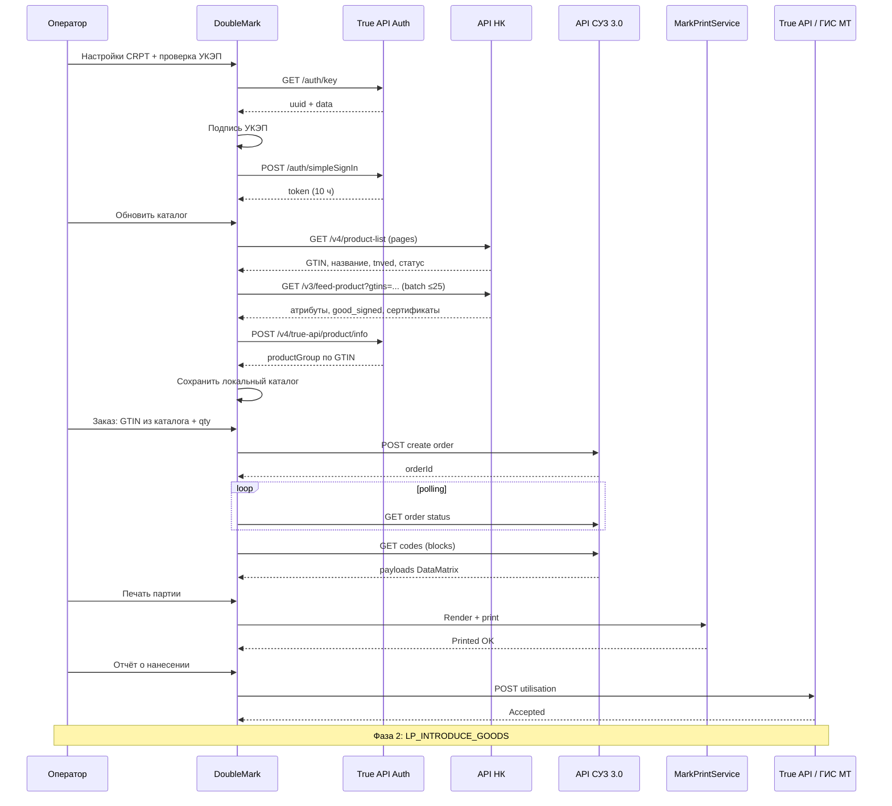
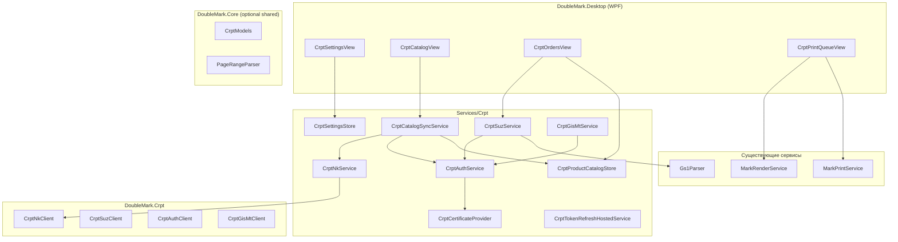

# Задача: интеграция DoubleMark с Честным ЗНАКом (СУЗ + True API)

**Статус:** черновик спецификации  
**Цель:** заказ кодов маркировки от имени **производителя** через официальные API ЦРПТ, печать в DoubleMark, отчёт о нанесении и (фаза 2) ввод в оборот — аналог блока настроек Контур.Маркировки.  
**Не входит в MVP:** Диадок, УПД, маркетплейсы, полная агрегация GS1.

---

## Содержание

1. [Кontext и границы](#1-context-и-границы)
2. [Соответствие настройкам Контур.Маркировки](#2-соответствие-настройкам-контурмаркировки)
3. [Бизнес-процесс производителя](#3-бизнес-процесс-производителя)
4. [Архитектура](#4-архитектура)
5. [Структура проекта](#5-структура-проекта)
6. [Модели данных](#6-модели-данных)
7. [Настройки и хранение секретов](#7-настройки-и-хранение-секретов)
8. [Авторизация True API](#8-авторизация-true-api)
9. [API СУЗ 3.0 — заказ кодов](#9-api-суз-30--заказ-кодов) (в т.ч. [9.5 НК — синхронизация](#95-национальный-каталог--синхронизация-товаров))
10. [После печати: нанесение и оборот](#10-после-печати-нанесение-и-оборот)
11. [UI / UX](#11-ui--ux)
12. [Безопасность и AGENTS.md](#12-безопасность-и-agentsmd)
13. [Фазы реализации](#13-фазы-реализации)
14. [Тестирование](#14-тестирование)
15. [Риски и открытые вопросы](#15-риски-и-открытые-вопросы)
16. [Ссылки на документацию ЦРПТ](#16-ссылки-на-документацию-црпт)

---

## 1. Context и границы

### 1.1 Текущее состояние DoubleMark

- Сканирование (COM / HID / Raw Input) с сохранением GS `0x1D` и AI 91/92.
- Парсинг GS1 (`Gs1Parser`), печать DataMatrix (`MarkRenderService`).
- PDF-пакетная печать (чтение кода со страницы PDF).
- **Нет** прямой интеграции с ЦРПТ / СУЗ / True API.

### 1.2 Целевое состояние (MVP)

Производитель в DoubleMark:

1. Настраивает подключение (OMS ID, Connection ID, УКЭП, URL СУЗ, при необходимости API KEY НК).
2. Получает и **автообновляет** токен True API (~10 ч).
3. Нажимает **«Обновить каталог»** — подтягивает GTIN и атрибуты карточек из Национального каталога в локальную базу.
4. Создаёт заказ кодов по GTIN из каталога + количество (товарная группа и шаблон подставляются автоматически, где возможно).
5. Скачивает КМ из СУЗ в локальную очередь.
6. Печатает этикетки существующим pipeline.
7. Отправляет **отчёт о нанесении** по напечатанным кодам.

### 1.3 Фаза 2 (после MVP)

- Ввод в оборот (`LP_INTRODUCE_GOODS`) — **probe проверен**, UI в backlog.
- Инкрементальная синхронизация НК через `etagslist` (**C7.1**, `CrptCatalogSyncService`, `NkIncrementalSyncEnabled` в настройках).
- Создание/редактирование карточек в НК из DoubleMark (не только чтение).
- Агрегация (GS1 GLN).
- Диадок / УПД.

### 1.4 Роли организации

| Роль | MVP | Комментарий |
|------|-----|-------------|
| **Производитель** | ✅ | Основной сценарий |
| Импортер | ⏳ фаза 2 | Другие типы документов ввода |
| Оптовик / ритейл / селлер | ❌ | Отгрузка, не эмиссия |

---

## 2. Соответствие настройкам Контур.Маркировки

Экран настроек DoubleMark должен покрывать те же смысловые блоки:

| Блок Контура | Поле DoubleMark | Хранение | API |
|--------------|-----------------|----------|-----|
| Роль организации | `OrganizationRoles[]` | settings | влияет на UI и тип документов |
| Товарные группы | `ProductGroups[]` | settings | `productGroup` в СУЗ |
| GS1 | `Gs1OrganizationNumber` | settings | агрегация (фаза 2) |
| Адрес СУЗ | `SuzBaseUrl` | settings | HttpClient BaseAddress |
| OMS ID | `OmsId` | **encrypted** | header / query по спецификации v3 |
| Идентификатор соединения | `ConnectionId` | **encrypted** | clientToken / device binding |
| Продление доступа | `CertificateThumbprint`, `TokenExpiresAt` | runtime + encrypted thumbprint | True API auth |
| Автопродление | `AutoRefreshToken` | settings | `CrptAuthService` timer |
| Национальный каталог | `NkBaseUrl`, `NkApiKey` (optional), `NkUseJwtFromTrueApi` | settings + **encrypted** apikey | API НК v3/v4 |
| Каталог товаров (локальный) | `CrptProductCatalog` | `%AppData%` JSON/SQLite | sync из НК + True API |
| Диадок | — | — | вне scope |

**Пример значений (placeholder, не production):**

```json
{
  "suzBaseUrl": "https://suzgrid.crpt.ru/",
  "trueApiBaseUrl": "https://markirovka.crpt.ru/",
  "omsId": "00000000-0000-4000-8000-000000000001",
  "connectionId": "00000000-0000-4000-8000-000000000002",
  "inn": "0000000000",
  "gs1OrganizationNumber": "0000000000000",
  "nkBaseUrl": "https://апи.национальный-каталог.рф/",
  "nkUseJwtFromTrueApi": true
}
```

---

## 3. Бизнес-процесс производителя



---

## 4. Архитектура

### 4.1 Слои



### 4.2 Принципы

- **UI не блокируется:** все HTTP + подпись — `async` / `Task.Run`, прогресс через `IProgress<T>`.
- **Токен один на сессию:** `CrptAuthService` — singleton, потокобезопасный refresh.
- **Payload кодов:** byte-exact, без нормализации при сохранении из СУЗ; парсинг — через `Gs1BarcodeEncoding.NormalizeForParse`.
- **Контуры:** `CrptEnvironment.Sandbox | Production` — разные Base URL из настроек.
- **Идемпотентность заказов:** локальный `orderId` + статус; повтор get codes по `lastBlockId`.
- **Каталог локальный:** синхронизация из НК не блокирует UI; прогресс «150 / 230 GTIN»; повторный sync upsert по `gtin`.
- **Готовность к заказу:** в combobox только карточки с `CanOrderCodes = true` (published + signed + известна productGroup).

---

## 5. Структура проекта

```
src/DoubleMark.Crpt/                    # библиотека (probe + Desktop)
  CrptAuthClient.cs
  CrptSuzClient.cs
  CrptGisMtClient.cs
  CrptNkClient.cs                         # API Национального каталога
  CrptNkProductMapper.cs
  CrptTrueApiProductClient.cs             # product/info → productGroup
  CrptConnectionSettings.cs
  CryptoProCadesSigner.cs

src/DoubleMark.Desktop/
  Settings/
    CrptSettings.cs
    CrptSettingsStore.cs
  Services/Crpt/
    CrptCatalogSyncService.cs             # orchestration sync
    CrptProductCatalogStore.cs            # локальный каталог JSON/SQLite
    CrptOrderRepository.cs
    CrptTokenRefreshService.cs
  Views/
    CrptSettingsView.xaml(.cs)
    CrptCatalogView.xaml(.cs)             # таблица + «Обновить»
    CrptOrdersView.xaml(.cs)
  MainWindow.Crpt.cs

src/DoubleMark.Core/Crpt/
  CrptProductCatalogItem.cs
  CrptProductGroup.cs
  SuzOrderStatus.cs

tests/DoubleMark.Core.Tests/Crpt/
  CrptNkProductMapperTests.cs
  CrptSuzRequestBuilderTests.cs
  CrptAuthResponseParserTests.cs

tools/DoubleMark.CrptProbe/
  Program.cs                              # --sync-catalog (manual integration)
```

---

## 6. Модели данных

### 6.1 Настройки

```csharp
namespace DoubleMark.Desktop.Settings;

public enum CrptOrganizationRole
{
    Manufacturer,
    Importer,
    Wholesaler,
    Retailer,
    Seller,
    Exporter,
    Government,
    HoReCa
}

public enum CrptEnvironment
{
    Sandbox,
    Production
}

public sealed class CrptSettings
{
    public CrptEnvironment Environment { get; set; } = CrptEnvironment.Sandbox;
    public List<CrptOrganizationRole> Roles { get; set; } = [CrptOrganizationRole.Manufacturer];
    public List<string> ProductGroups { get; set; } = [];

    public string Inn { get; set; } = "";
    public string? Gs1OrganizationNumber { get; set; }

    public string SuzBaseUrl { get; set; } = "https://suzgrid.crpt.ru/";
    public string TrueApiBaseUrl { get; set; } = "https://markirovka.crpt.ru/";

    // Секреты — только через CrptSettingsStore (DPAPI), не в plain appsettings
    public string? OmsId { get; set; }
    public string? ConnectionId { get; set; }
    public string? CertificateThumbprint { get; set; }

    public bool AutoRefreshToken { get; set; } = true;
    public string? ContactPerson { get; set; }

    // Национальный каталог
    public string NkBaseUrl { get; set; } = "https://апи.национальный-каталог.рф/";
    public bool NkUseJwtFromTrueApi { get; set; } = true;   // иначе — отдельный apikey

    [Obsolete("Sync stores all cards; use catalog UI filters instead.")]
    public bool NkSyncOnlyPublished { get; set; }          // default false; ignored by sync (June 2026)

    [Obsolete("Sync stores all cards; use catalog UI filters instead.")]
    public bool NkSyncOnlySigned { get; set; }               // default false; ignored by sync (June 2026)

    /// <summary>Auto-discovered NK categories (updated on sync).</summary>
    public List<string> NkKnownCategories { get; set; } = [];
    /// <summary>User-selected categories visible in catalog. Empty — show all.</summary>
    public List<string> NkVisibleCategories { get; set; } = [];

    /// <summary>templateId по productGroup, напр. { "chemistry": 46 }</summary>
    public Dictionary<string, int> ProductGroupTemplateDefaults { get; set; } = [];
}
```

### 6.2 Каталог товаров (локальный)

```csharp
namespace DoubleMark.Core.Crpt;

public sealed class CrptProductCatalogItem
{
    public required string Gtin { get; init; }
    public int? GoodId { get; init; }
    public string Name { get; init; } = "";
    public string? TnvedCode { get; init; }           // полный код (attr «Код ТНВЭД»)
    public string? TnvedGroup { get; init; }           // краткий из product-list
    public string? ProductGroup { get; init; }        // chemistry, milk, … (True API)
    public int? TemplateId { get; init; }             // override или default по ТГ
    public string NkStatus { get; init; } = "";       // published / draft / …
    public bool IsSigned { get; init; }
    public bool CanOrderCodes { get; init; }
    public string? CertificateDocType { get; init; }
    public string? CertificateDocNumber { get; init; }
    public string? CertificateDocDate { get; init; }
    public DateTimeOffset SyncedAt { get; init; }
    public string? SyncError { get; init; }
}

public sealed record CrptCatalogSyncProgress(
    string Stage,           // "product-list" | "feed-product" | "product-info"
    int Processed,
    int Total,
    string? CurrentGtin);
```

### 6.3 Заказ и код

```csharp
namespace DoubleMark.Desktop.Services.Crpt;

public enum CrptCodeLifecycleStatus
{
    Received,       // скачан из СУЗ
    QueuedForPrint,
    Printed,
    UtilisationSent,
    InCirculation,
    Error
}

public sealed record CrptSuzOrder(
    string LocalId,
    string? RemoteOrderId,
    string Gtin,
    int RequestedQuantity,
    int ReceivedQuantity,
    string ProductGroup,
    SuzOrderRemoteStatus RemoteStatus,
    DateTimeOffset CreatedAt,
    DateTimeOffset? CompletedAt,
    string? ErrorMessage);

public sealed record CrptMarkingCodeItem(
    int Id,
    string OrderLocalId,
    string RawPayload,          // НЕ логировать, НЕ отправлять в cloud
    CrptCodeLifecycleStatus Status,
    DateTimeOffset? PrintedAt,
    string? LastError);
```

### 6.4 Токен

```csharp
public sealed record CrptAuthToken(
    string Value,
    DateTimeOffset ExpiresAt,
    bool IsUnitedUuidToken);
```

---

## 7. Настройки и хранение секретов

### 7.1 Файлы

| Файл | Содержимое |
|------|------------|
| `%AppData%\DoubleMark\crpt-settings.json` | Inn, URLs, roles, product groups, NK URL (без секретов) |
| `%AppData%\DoubleMark\crpt-secrets.dat` | OMS ID, ConnectionId, thumbprint, **NkApiKey** — **ProtectedData DPAPI** |
| `%AppData%\DoubleMark\crpt-catalog.json` | локальный каталог GTIN (без КМ) |

### 7.2 CrptSettingsStore (скелет)

```csharp
using System.Security.Cryptography;
using System.Text.Json;

public sealed class CrptSettingsStore
{
    private static string SettingsPath =>
        Path.Combine(AppSettings.SettingsDirectory, "crpt-settings.json");

    private static string SecretsPath =>
        Path.Combine(AppSettings.SettingsDirectory, "crpt-secrets.dat");

    public CrptSettings LoadSettings()
    {
        if (!File.Exists(SettingsPath))
            return new CrptSettings();
        return JsonSerializer.Deserialize<CrptSettings>(File.ReadAllText(SettingsPath)) ?? new();
    }

    public CrptSecrets LoadSecrets()
    {
        if (!File.Exists(SecretsPath))
            return new CrptSecrets();
        var protectedBytes = File.ReadAllBytes(SecretsPath);
        var json = ProtectedData.Unprotect(protectedBytes, null, DataProtectionScope.CurrentUser);
        return JsonSerializer.Deserialize<CrptSecrets>(json) ?? new();
    }

    public void Save(CrptSettings settings, CrptSecrets secrets)
    {
        Directory.CreateDirectory(AppSettings.SettingsDirectory);
        File.WriteAllText(SettingsPath, JsonSerializer.Serialize(settings, JsonOptions));
        var plain = JsonSerializer.SerializeToUtf8Bytes(secrets);
        var protectedBytes = ProtectedData.Protect(plain, null, DataProtectionScope.CurrentUser);
        File.WriteAllBytes(SecretsPath, protectedBytes);
    }
}

public sealed class CrptSecrets
{
    public string? OmsId { get; set; }
    public string? ConnectionId { get; set; }
    public string? CertificateThumbprint { get; set; }
    public string? NkApiKey { get; set; }              // если NkUseJwtFromTrueApi = false
}
```

---

## 8. Авторизация True API

### 8.1 Алгоритм

1. `GET {trueApi}/auth/key` → `{ uuid, data }`
2. Подписать `data` detached CMS (УКЭП) → Base64
3. `POST {trueApi}/auth/simpleSignIn`  
   `{ "uuid", "data", "inn", "unitedToken": true }`
4. Ответ: `{ "token", "expireDate" }` — **срок ~10 часов**, продление = новый запрос

### 8.2 CrptAuthService (скелет)

```csharp
public sealed class CrptAuthService : ICrptAuthService
{
    private readonly ICrptCertificateProvider _certs;
    private readonly SemaphoreSlim _refreshLock = new(1, 1);
    private CrptAuthToken? _cached;

    public async Task<string> GetValidTokenAsync(CancellationToken ct)
    {
        if (_cached != null && _cached.ExpiresAt > DateTimeOffset.UtcNow.AddMinutes(15))
            return _cached.Value;

        await _refreshLock.WaitAsync(ct);
        try
        {
            if (_cached != null && _cached.ExpiresAt > DateTimeOffset.UtcNow.AddMinutes(15))
                return _cached.Value;

            _cached = await RefreshTokenCoreAsync(ct);
            return _cached.Value;
        }
        finally
        {
            _refreshLock.Release();
        }
    }

    private async Task<CrptAuthToken> RefreshTokenCoreAsync(CancellationToken ct)
    {
        // 1. GET /auth/key
        var key = await _http.GetFromJsonAsync<AuthKeyResponse>("/auth/key", ct)
            ?? throw new InvalidOperationException("CRPT auth/key empty");

        // 2. Sign key.Data with UKEP
        var signedBase64 = _certs.SignBase64Detached(key.Data);

        // 3. POST /auth/simpleSignIn
        var body = new AuthSignInRequest
        {
            Uuid = key.Uuid,
            Data = signedBase64,
            Inn = _settings.Inn,
            UnitedToken = true
        };

        using var response = await _http.PostAsJsonAsync("/auth/simpleSignIn", body, ct);
        response.EnsureSuccessStatusCode();
        var token = await response.Content.ReadFromJsonAsync<AuthSignInResponse>(ct)
            ?? throw new InvalidOperationException("CRPT simpleSignIn empty");

        return new CrptAuthToken(token.Token, token.ExpireDate, true);
    }
}
```

### 8.3 Автообновление (аналог галочки Контура)

```csharp
public sealed class CrptTokenRefreshService : BackgroundService
{
    protected override async Task ExecuteAsync(CancellationToken stoppingToken)
    {
        while (!stoppingToken.IsCancellationRequested)
        {
            if (_settings.AutoRefreshToken)
            {
                try { await _auth.GetValidTokenAsync(stoppingToken); }
                catch (Exception ex) { LoggingService.Warn("CrptAuth", "Token refresh failed", ex); }
            }
            await Task.Delay(TimeSpan.FromHours(8), stoppingToken);
        }
    }
}
```

### 8.4 UI: «Продлить доступ»

Кнопка вызывает `RefreshTokenCoreAsync` принудительно и показывает `ExpiresAt`.

---

## 9. API СУЗ 3.0 — заказ кодов

> **Важно:** точные URL и имена полей `attributes` зависят от **товарной группы**. Перед реализацией скачать актуальную «API СУЗ 3.0» из ЛК и зафиксировать в этом документе appendix для вашей ТГ.

### 9.1 Общие заголовки (шаблон)

```csharp
private async Task<HttpRequestMessage> CreateSuzRequestAsync(
    HttpMethod method,
    string relativeUrl,
    HttpContent? content,
    CancellationToken ct)
{
    var token = await _auth.GetValidTokenAsync(ct);
    var req = new HttpRequestMessage(method, relativeUrl) { Content = content };
    req.Headers.Authorization = new AuthenticationHeaderValue("Bearer", token);
    req.Headers.Add("clientToken", _secrets.ConnectionId); // имя — по спецификации v3
    req.Headers.Add("X-OMS-Id", _secrets.OmsId);           // уточнить по PDF
    return req;
}
```

### 9.2 Создание заказа (производитель)

```csharp
public sealed record CreateSuzOrderRequest
{
    public required string ProductGroup { get; init; }
    public required IReadOnlyList<CreateSuzOrderProduct> Products { get; init; }
    public Dictionary<string, object>? Attributes { get; init; }
}

public sealed record CreateSuzOrderProduct
{
    public required string Gtin { get; init; }
    public required int Quantity { get; init; }
    public string? SerialNumberType { get; init; }
    public int? TemplateId { get; init; }
}

// Пример для производства РФ (поля attributes — заменить по документации ТГ):
var request = new CreateSuzOrderRequest
{
    ProductGroup = "softdrinks", // пример
    Products =
    [
        new CreateSuzOrderProduct
        {
            Gtin = "04600000000000",
            Quantity = 1000,
            SerialNumberType = "OPERATOR" // enum из документации
        }
    ],
    Attributes = new Dictionary<string, object>
    {
        ["releaseMethodType"] = "PRODUCTION" // уточнить enum для ТГ
    }
};
```

### 9.3 CrptSuzClient — orchestration

```csharp
public sealed class CrptSuzClient : ICrptSuzClient
{
    public async Task<CrptSuzOrder> CreateAndDownloadOrderAsync(
        CreateSuzOrderRequest request,
        IProgress<SuzOrderProgress>? progress,
        CancellationToken ct)
    {
        var remoteOrderId = await CreateOrderAsync(request, ct);
        progress?.Report(new SuzOrderProgress("Ожидание СУЗ", 0));

        while (true)
        {
            ct.ThrowIfCancellationRequested();
            var status = await GetOrderStatusAsync(remoteOrderId, ct);
            if (status.IsTerminalFailure)
                throw new CrptSuzException(status.ErrorMessage ?? "SUZ order failed");
            if (status.IsReadyForDownload)
                break;
            await Task.Delay(TimeSpan.FromSeconds(10), ct);
        }

        var items = new List<CrptMarkingCodeItem>();
        string? lastBlockId = null;
        while (true)
        {
            var block = await GetCodesBlockAsync(remoteOrderId, request.Products[0].Gtin, lastBlockId, ct);
            foreach (var raw in block.Codes)
            {
                // Валидация без изменения payload
                if (!Gs1BarcodeEncoding.LooksLikeGs1Cz(raw))
                    throw new InvalidOperationException("SUZ returned non-GS1 payload");
                items.Add(new CrptMarkingCodeItem(/* ... */));
            }
            if (block.IsLast)
                break;
            lastBlockId = block.BlockId;
        }

        await CloseOrderAsync(remoteOrderId, ct);
        return BuildLocalOrder(remoteOrderId, request, items);
    }
}
```

### 9.4 Лимиты (ориентир v3)

| Параметр | Значение |
|----------|----------|
| Кодов на 1 GTIN в заказе | до 2 000 000 |
| GTIN в одном заказе | до 10 позиций |
| Версия API | только **v3** (v2 отключён) |

---

### 9.5 Национальный каталог — синхронизация товаров

**Цель:** оператор настраивает подключение → нажимает **«Обновить каталог»** → в DoubleMark появляется список GTIN с названиями и полями, нужными для заказа СУЗ и (позже) ввода в оборот.

#### 9.5.1 Стенды и авторизация

| Контур | Base URL |
|--------|----------|
| Production | `https://апи.национальный-каталог.рф/` (кириллическое **апи**, не латинское `api`) |
| Sandbox | `https://api.nk.sandbox.crptech.ru/` |

Авторизация (один из вариантов):

| Способ | Параметр | Где взять |
|--------|----------|-----------|
| JWT True API | `Authorization: Bearer <token>` | `CrptAuthService` после УКЭП (**рекомендуется**) |
| API KEY | `apikey=<key>` в query | ЛК НК → Профиль → Данные участника → **API KEY** (роль «Администратор») |

#### 9.5.2 Методы API НК

| Шаг | Метод | Назначение |
|-----|-------|------------|
| 1 | `GET /v4/product-list?limit=&offset=` | Список **всех** своих карточек (кратко: GTIN, название, `tnved`, статус). До 1000 за запрос, до 10 000 за период |
| 2 | `GET /v3/feed-product?gtins=a;b;c` | Полная карточка пакетами **≤25 GTIN**: `good_signed`, атрибуты, сертификаты, полный «Код ТНВЭД» (attr_id 13933) |
| 3 | `POST /api/v4/true-api/product/info` | **productGroup** по GTIN (True API, тот же JWT) |
| 4 (фаза 2) | `GET /v3/etagslist` | Инкрементальное обновление только изменившихся карточек (**реализовано C7.1**: сравнение etag, `feed-product` только для изменённых GTIN; полный `product-list` при пустом каталоге или fallback) |

Документация: [API НК](https://docs.crpt.ru/gismt/API_%D0%9D%D0%9A/).

#### 9.5.3 Маппинг полей → заказ СУЗ / оборот

| Поле DoubleMark | Источник | Обязательно для заказа |
|-----------------|----------|------------------------|
| `Gtin` | `product-list.gtin` | ✅ |
| `Name` | `product-list.good_name` | UI |
| `TnvedCode` | `feed-product` → attr «Код ТНВЭД» | оборот |
| `ProductGroup` | True API `product/info` | ✅ |
| `TemplateId` | настройки по ТГ (`ProductGroupDefaults`) | ✅ |
| `CertificateDoc*` | `feed-product` → группа «Сертификаты» | оборот |
| `CanOrderCodes` | вычисляемое: `TradeUnit` + `published` + `good_signed` + `ProductGroup` известна | UI filter |
| `NkProductState`, `NkCardType`, `CategoryName`, `NkUpdatedAt` | product-list + feed-product | UI filters / columns |

**Не приходит из НК:** `templateId`, `productGroup` (только через True API), `quantity` (ввод пользователя).

**ProductGroup vs CategoryName:** `productGroup` — код True API / СУЗ (напр. `chemistry`); `CategoryName` — категория из НК (напр. «Товары для ароматизации»). В UI колонка «Товарная группа» показывает русское имя из справочника ЦРПТ (`CrptProductGroupCatalog`), колонка «Категория» — значение NK `category`.

#### 9.5.3.1 Справочник productGroup (True API → UI)

Источник: [Exchange True API](https://docs.crpt.ru/gismt/Exchange/), Приложение 1 «Список поддерживаемых товарных групп» (актуально на 2026-06). Реализация: `CrptProductGroupCatalog.cs`.

| Код API | Код БД | Русское наименование |
|---------|--------|----------------------|
| `lp` | 1 | Лёгкая промышленность |
| `shoes` | 2 | Обувные товары |
| `tobacco` | 3 | Табачная продукция |
| `perfumery` | 4 | Духи и туалетная вода |
| `tires` | 5 | Шины и покрышки пневматические резиновые новые |
| `electronics` | 6 | Фотокамеры (кроме кинокамер), фотовспышки и лампы-вспышки |
| `pharma` | 7 | Лекарственные препараты для медицинского применения |
| `milk` | 8 | Молочная продукция |
| `bicycle` | 9 | Велосипеды и велосипедные рамы |
| `wheelchairs` | 10 | Медицинские изделия |
| `alcohol` | 11 | Алкоголь |
| `otp` | 12 | Альтернативная табачная продукция |
| `water` | 13 | Упакованная вода |
| `furs` | 14 | Товары из натурального меха |
| `beer` | 15 | Пиво, напитки, изготавливаемые на основе пива, слабоалкогольные напитки |
| `ncp` | 16 | Никотиносодержащая продукция |
| `bio` | 17 | Специализированная пищевая продукция и БАД к пище |
| `antiseptic` | 19 | Антисептики и дезинфицирующие средства |
| `petfood` | 20 | Корма для животных |
| `seafood` | 21 | Морепродукты |
| `nabeer` | 22 | Безалкогольное пиво |
| `softdrinks` | 23 | Соковая продукция и безалкогольные напитки |
| `meat` | 25 | Мясные изделия |
| `vetpharma` | 26 | Ветеринарные препараты |
| `toys` | 27 | Игры и игрушки для детей |
| `radio` | 28 | Радиоэлектронная продукция |
| `titan` | 31 | Титановая металлопродукция |
| `conserve` | 32 | Консервированная продукция |
| `vegetableoil` | 33 | Растительные масла |
| `opticfiber` | 34 | Оптоволокно и оптоволоконная продукция |
| `chemistry` | 35 | Косметика, бытовая химия и товары личной гигиены |
| `books` | 36 | Печатная продукция |
| `grocery` | 37 | Бакалейная продукция |
| `pharmaraw` | 38 | Фармацевтическое сырьё, лекарственные средства |
| `construction` | 39 | Строительные материалы |
| `fire` | 40 | Пиротехника и огнетушащее оборудование |
| `heater` | 41 | Отопительные приборы |
| `cableraw` | 42 | Кабельно-проводниковая продукция |
| `autofluids` | 43 | Моторные масла |
| `polymer` | 44 | Полимерные трубы |
| `sweets` | 45 | Сладости и кондитерские изделия |
| `carparts` | 48 | Автозапчасти и комплектующие транспортных средств |
| `furslp` | 49 | Натуральный мех |
| `nicotindev` | 50 | Радиоэлектронная продукция. Электронные системы доставки никотина |
| `gadgets` | 51 | Радиоэлектронная продукция. Ноутбуки и смартфоны |
| `frozen` | 52 | Полуфабрикаты и замороженные продукты |
| `fertilizers` | 53 | Удобрения в потребительской упаковке |
| `homeware` | 54 | Товары для дома и интерьера |
| `pyrotechnics` | 59 | Пиротехнические изделия |

Неизвестные коды в UI отображаются как есть (нормализованный API-код).

#### 9.5.4 CrptCatalogSyncService (orchestration)

```csharp
public sealed class CrptCatalogSyncService
{
    public async Task<CrptCatalogSyncResult> SyncAsync(
        IProgress<CrptCatalogSyncProgress>? progress,
        CancellationToken ct)
    {
        // 1. JWT или apikey из настроек
        // 2. product-list: limit=1000, offset+=1000 пока total не исчерпан (без good_status query)
        // 3. Upsert **все** карточки из product-list (+ merge feed-product); NkSyncOnly* deprecated
        // 4. feed-product батчами по 25 gtins
        // 5. product/info для productGroup (с rate-limit паузами)
        // 6. TemplateId из CrptSettings.ProductGroupDefaults или probe cache
        // 7. Auto-merge CategoryName → NkKnownCategories в настройках
        // 8. Upsert в CrptProductCatalogStore
        // 9. Вернуть counts: added, updated, errors (FilteredByPublished/Signed всегда 0)
    }
}
```

#### 9.5.5 Лимиты и краевые случаи

| Ситуация | Поведение |
|----------|-----------|
| >10 000 карточек за месяц | Разбить `product-list` по `from_date` / `to_date` или перейти на `etagslist` (фаза 2) |
| HTTP 429 | Exponential backoff, показать «повтор через N сек» из `Retry-After` |
| Карточка draft / notsigned | В каталоге видна, но `CanOrderCodes = false` + подсказка в UI |
| Набор / комплект (`is_set`, `is_kit`) | MVP: пропуск или отдельный флаг; заказ только `trade-unit` |
| productGroup не найден | `CanOrderCodes = false`, предложить ручной override в настройках ТГ |

#### 9.5.6 Probe

```bash
dotnet run --project tools/DoubleMark.CrptProbe -- crpt-probe.local.json --sync-catalog
dotnet run --project tools/DoubleMark.CrptProbe -- crpt-probe.local.json --sync-catalog --gtin 04620490950423
```

---

## 10. После печати: нанесение и оборот

### 10.1 MVP — отчёт о нанесении

После успешной печати в DoubleMark:

```csharp
public sealed record UtilisationReportRequest
{
    public required string ProductGroup { get; init; }
    public required IReadOnlyList<string> RawPayloads { get; init; }
    // + поля по ТГ (usageType, productionDate, ...)
}
```

Метод True API / СУЗ: `POST .../cises/utilisation` (уточнить path в True API PDF).

### 10.2 Фаза 2 — ввод в оборот (производитель)

Документ ГИС МТ: **`LP_INTRODUCE_GOODS`** (или актуальное имя для «Производство РФ»).

```csharp
// Скелет — структура документа из True API, не хардкодить без PDF
public sealed record IntroduceGoodsDocument
{
    public required string DocumentFormat { get; init; } // "MANUAL" / XML
    public required string ProductGroup { get; init; }
    public required IReadOnlyList<string> Codes { get; init; }
    public DateOnly? ProductionDate { get; init; }
}
```

---

## 11. UI / UX

### 11.1 Страница «Маркировка → Настройки»

Секции (как Контур):

1. **Роль и товарные группы** — чекбоксы.
2. **GS1** — рег. номер (optional).
3. **СУЗ** — URL, OMS ID, Connection ID, контакт.
4. **Сертификат** — выбор из хранилища Windows, thumbprint, срок УКЭП.
5. **Доступ** — «Токен действует до …», кнопки «Проверить» / «Продлить», ☑ автопродление.
6. **Национальный каталог** — URL НК, ☑ «использовать JWT True API» / поле API KEY, шаблоны `templateId` по товарной группе.
7. **Контур** — Sandbox / Production.

### 11.2 Страница «Каталог товаров»

- Кнопка **«Обновить из Национального каталога»** (primary action после первой настройки).
- Прогресс: `Карточки товаров: 150 / 230 · GTIN …` (GTIN только в UI, не в log-файлах).
- Headline после sync: «Загружено N из НК, в каталоге N» (без skip по published/signed).
- Таблица (как ЛК НК): GTIN, название, ТН ВЭД, **дата изменения**, **состояние**, **статус карточки**, **тип**, **категория**, товарная группа, **можно заказать коды** (без колонки фото).
- Поиск in-memory: название, GTIN, ТН ВЭД (substring, без учёта регистра).
- Фильтры UI: **состояние товара** / **статус карточки** / **тип** (ComboBox как в ЛК НК); категории — из `NkVisibleCategories` в настройках; legacy: все / для заказа / с ошибками sync.
- `CanOrderCodes` только для `TradeUnit` (набор/комплект видны, заказ disabled + tooltip).
- Действия строки: «Заказать коды» → переход на форму заказа с выбранным GTIN.
- Footer: «Последняя синхронизация: …».
- Настройки: чекбоксы `NkSyncOnlyPublished/Signed` скрыты/disabled — «Фильтруйте в каталоге».

### 11.3 Страница «Заказы кодов»

- Форма: GTIN (**combobox из локального каталога**, только `CanOrderCodes`), кол-во, ТГ (readonly, из каталога), templateId (readonly или override).
- Если каталог пуст — banner «Обновите каталог из Национального каталога».
- Таблица заказов: дата, GTIN, qty, статус, ошибка.
- Действия: «Скачать коды», «Открыть очередь печати».

### 11.4 Очередь печати

- Переиспользовать `MarkRenderService` + `MarkPrintService`.
- Статусы строк синхронизировать с `CrptCodeLifecycleStatus`.
- **Запрет** редактирования raw payload в TextBox (AGENTS.md).

### 11.5 Навигация

Добавить пункты в sidebar **«Маркировка CRPT»** (premium feature):

1. Настройки
2. **Каталог товаров**
3. Заказы кодов
4. Очередь печати

---

## 12. Безопасность и AGENTS.md

### 12.1 Обязательные правила

- **Не логировать** raw payload, AI 92, crypto tail.
- **Не отправлять** коды в Supabase / cloud / внешние сервисы.
- **Не коммитить** OMS ID, Connection ID, токены, `.env` с секретами.
- **Не использовать** реальные КМ в тестах, docs, prompts.
- Сохранять GS `0x1D` byte-exact при записи из СУЗ и при печати.

### 12.2 Тестовые данные

```csharp
// tests — только синтетика
public static class CrptTestFixtures
{
    public const string SyntheticGtin = "04600000000000";
    public const string SyntheticPayload = "010460000000000021SYNTH";
}
```

### 12.3 Регистрация как технологический партнёр

Для **коммерческой** продажи интеграции другим УОТ — пройти [реестр партнёров ЦРПТ](https://markirovka.ru/knowledge/developers/become-technology-partner/kak-stat-tekhnologicheskim-partnerom-tsrpt-instruktsiya).  
Для **внутреннего** использования одного производителя — достаточно API от своего УОТ.

---

## 13. Фазы реализации

### Фаза A — Настройки + Auth (DoD)

| # | Задача | DoD |
|---|--------|-----|
| A1 | `CrptSettings` + `CrptSettingsStore` (DPAPI) | секреты не в plain JSON |
| A2 | `CrptCertificateProvider` — выбор УКЭП, подпись | тестовая подпись на sandbox |
| A3 | `CrptAuthService` — key + simpleSignIn | токен + expireDate в UI |
| A4 | `CrptTokenRefreshService` | авто refresh каждые 8 ч |
| A5 | `CrptSettingsView` + «Проверить подключение» | зелёный статус на sandbox |

### Фаза B₀ — Каталог НК (DoD)

> Выполняется **после фазы A**, **до** UI заказов (B4). Блокирует удобный выбор GTIN.

| # | Задача | DoD |
|---|--------|-----|
| B0.1 | `CrptNkClient` — `product-list`, `feed-product` | JSON fixtures + manual sandbox |
| B0.2 | `CrptTrueApiProductClient` — `product/info` | productGroup для тестового GTIN |
| B0.3 | `CrptNkProductMapper` → `CrptProductCatalogItem` | unit-тесты маппинга атрибутов |
| B0.4 | `CrptProductCatalogStore` — load/save JSON | переживает перезапуск |
| B0.5 | `CrptCatalogSyncService` + progress | полный sync ≥1 GTIN production/sandbox |
| B0.6 | `CrptCatalogView` + «Обновить каталог» | таблица + фильтр «готов к заказу» |
| B0.7 | Probe `--sync-catalog` | команда в Appendix C |
| B0.8 | Defaults `templateId` по productGroup | chemistry=46 из verified probe |

### Фаза B — Заказ СУЗ (DoD)

| # | Задача | DoD |
|---|--------|-----|
| B1 | `CrptSuzClient.CreateOrder` | orderId на sandbox |
| B2 | Polling status | переход в READY |
| B3 | Download codes blocks | ≥1 код в локальной БД |
| B4 | `CrptOrdersView` | UI создания заказа **из каталога** |
| B5 | Close order | заказ CLOSED в СУЗ |

### Фаза C — Печать (DoD)

| # | Задача | DoD |
|---|--------|-----|
| C1 | Очередь печати из `CrptMarkingCodeItem` | этикетка через шаблон |
| C2 | Статус Printed | без потери GS |
| C3 | Пакетная печать N кодов | как PDF batch pipeline |

### Фаза D — Нанесение (DoD)

| # | Задача | DoD |
|---|--------|-----|
| D1 | `CrptGisMtClient.SendUtilisation` | accepted на sandbox |
| D2 | UI «Отправить отчёт о нанесении» | только Printed коды |

### Фаза E — Оборот (backlog)

- Introduce goods UI (`LP_INTRODUCE_GOODS` — probe ✅)
- Инкрементальный sync НК (`etagslist`)
- GS1 aggregation
- Diadoc

---

## 14. Тестирование

### 14.1 Unit (Core / Desktop)

- Парсинг ответов auth (JSON fixtures).
- Маппинг `feed-product` → `CrptProductCatalogItem` (fixtures без реальных GTIN).
- Сборка тела заказа СУЗ (без HTTP).
- Маппинг статусов SUZ → `CrptSuzOrder`.

### 14.2 Integration (manual sandbox)

Чеклист:

1. [ ] Получен токен, `expireDate` > now.
2. [ ] **Sync catalog:** `product-list` + `feed-product` → локальный JSON с ≥1 GTIN.
3. [ ] Заказ 1 GTIN × 10 кодов — SUCCESS (GTIN из каталога).
4. [ ] Payload содержит `01` + `21`, GS сохранён для full codes.
5. [ ] Печать 10 этикеток — scanner safety review OK.
6. [ ] Utilisation report — SUCCESS.

### 14.3 Регрессия

После каждой фазы: `dotnet restore`, `dotnet build`, `dotnet test` (132+ tests).

---

## 15. Риски и открытые вопросы

| Риск | Митигация |
|------|-----------|
| CryptoPro только Windows | MVP — Windows; документировать зависимость |
| `suzgrid.crpt.ru` vs `suz2.crpt.ru` | URL только из ЛК заказчика |
| Разные `attributes` по ТГ | Appendix per product group в docs |
| Истечение Connection ID | UI «перевыпустить устройство» + инструкция |
| 10h token | auto-refresh + понятная ошибка 401 |
| Лимиты API НК (429) | backoff + `API-Usage-Limit` в UI |
| >10k карточек | date-range split / etagslist (фаза 2) |
| templateId не в НК | defaults по productGroup в настройках |
| Юридическая ответственность УОТ | disclaimer в UI |

**Открытые вопросы (заполнить перед Фазой B₀):**

- [ ] API KEY НК или только JWT?
- [ ] Sandbox GTIN для теста sync
- [ ] Таблица `templateId` по productGroup для всех ТГ производителя

**Открытые вопросы (заполнить перед Фазой B):**

- [ ] Точная **товарная группа** производителя
- [ ] Sandbox credentials и тестовый GTIN
- [ ] Имя enum `releaseMethodType` для ТГ
- [ ] Точный path create order в API СУЗ 3.0 для вашего контура

---

## 16. Ссылки на документацию ЦРПТ

Скачать из ЛК Честного ЗНАКа → **Помощь** (промышленный контур):

- True API (HTML/PDF): [docs.crpt.ru/gismt/True_API](https://docs.crpt.ru/gismt/True_API/)
- API СУЗ 3.0
- API Национального каталога: [docs.crpt.ru/gismt/API_НК](https://docs.crpt.ru/gismt/API_%D0%9D%D0%9A/)
- База знаний: [markirovka.ru](https://markirovka.ru)
- Стать технологическим партнёром: [инструкция](https://markirovka.ru/knowledge/developers/become-technology-partner/kak-stat-tekhnologicheskim-partnerom-tsrpt-instruktsiya)

---

## Appendix A — Чеклист настройки производителя (организационный)

1. [ ] УОТ зарегистрирован, УКЭП руководителя установлена
2. [ ] Товарные группы подключены в ЛК
3. [ ] GTIN заведены в Национальном каталоге (published + signed)
4. [ ] API KEY НК или JWT True API проверен
5. [ ] СУЗ → Устройства → OMS ID + Connection ID
6. [ ] КриптоПро CSP установлен
7. [ ] DoubleMark Фаза A: токен на sandbox
8. [ ] DoubleMark Фаза B₀: sync catalog ≥1 GTIN
9. [ ] DoubleMark Фаза B: API-заказ = ручной заказ

---

## Appendix B — Связь с существующим кодом DoubleMark

| Новый модуль | Переиспользует |
|--------------|----------------|
| Печать из СУЗ | `MarkRenderService`, `MarkPrintService`, `PrintTemplate` |
| Валидация payload | `Gs1Parser`, `MarkingCodeIntegrity`, `Gs1BarcodeEncoding` |
| Прогресс / jobs | паттерн `PdfBatchPrintPipeline`, `LoggingService` |
| Premium gate | `FeatureAccessRules`, `EnsureSubscriptionForFeatureAsync` |
| Каталог GTIN | локальный JSON, паттерн `ScanHistoryStore` / settings store |

---

## Appendix D — API Национального каталога (справка)

### Авторизация

```
GET https://апи.национальный-каталог.рф/v4/product-list?apikey=XXX&limit=100&offset=0
# или
GET .../v4/product-list?limit=100&offset=0
Authorization: Bearer <JWT True API>
```

API KEY: ЛК НК → Профиль → Данные участника (роль «Администратор»).

### Список карточек (кратко)

```
GET /v4/product-list?limit=1000&offset=0&good_status=published
```

Ответ: `{ result: { total, goods: [{ good_id, gtin, good_name, tnved, good_status, good_detailed_status, ... }] } }`.

### Полная карточка (batch)

```
GET /v3/feed-product?gtins=04620490950423;04600000000000
```

Max 25 GTIN за запрос. Использовать для `good_signed`, полного ТН ВЭД, сертификатов.

### productGroup (True API)

```
POST markirovka.crpt.ru/api/v4/true-api/product/info
Authorization: Bearer <JWT>
Body: { "gtins": ["04620490950423"] }
```

### Probe (план)

```bash
dotnet run --project tools/DoubleMark.CrptProbe -- crpt-probe.local.json --sync-catalog
```

---

## Appendix C — Проверенные вызовы API (промышленный контур, июнь 2026)

Проверено через `tools/DoubleMark.CrptProbe` + библиотека `src/DoubleMark.Crpt`.

### Аутентификация

| Шаг | Метод | Примечание |
|-----|-------|------------|
| Ключ | `GET markirovka.crpt.ru/api/v3/true-api/auth/key` | uuid + data (base64) |
| Подпись | CryptoPro CAdESCOM attached | GOST УКЭП, не `SignedCms` |
| СУЗ-токен | `POST .../auth/simpleSignIn/{connectionId}` | body: `{uuid, data}` |
| JWT (ГИС МТ) | `POST .../auth/simpleSignIn` | body: `{uuid, data, inn, unitedToken:false}` |

**Заголовки СУЗ:** только `clientToken: <token>`. Нельзя одновременно `Authorization` + `clientToken` (ошибка 1450).

### Заказ кодов (СУЗ 3.0)

| Шаг | Метод |
|-----|-------|
| Ping | `GET suzgrid.crpt.ru/api/v3/ping?omsId=...` |
| Заказ | `POST api/v3/order?omsId=...` + `X-Signature` (detached, JSON body → base64 content) |
| Статус | `GET api/v3/order/status?omsId&orderId&gtin` |
| Скачивание | `GET api/v3/codes?omsId&orderId&gtin&quantity=...` |

**Параметры для ООО ТПК (chemistry):** `productGroup=chemistry`, `templateId=46`, `releaseMethodType=PRODUCTION`, `createMethodType=SELF_MADE`.

Коды: 78 символов, начинаются с `01`, содержат GS `0x1D` (2 раза), не base64.

### Отчёт о нанесении

`POST suzgrid.crpt.ru/api/v3/utilisation?omsId=...` + `X-Signature`

Для **chemistry** в `attributes` нужны `productionDate` и `expirationDate` (формат `yyyy-MM-dd`). Поля `usageType` / `cisType` — **не** для этой ТГ (ошибка 6730).

### Ввод в оборот (LP_INTRODUCE_GOODS)

1. Собрать JSON `Promotion_Inform_Selfmade` с `uit_code` = **сокращённый** КМ (01+GTIN+21+serial, до первого GS).
2. Подписать detached УКЭП **base64-строку** `product_document` (`ContentEncoding=BASE64_TO_BINARY`, как для заказа СУЗ).
3. `POST markirovka.crpt.ru/api/v3/true-api/lk/documents/create?pg=chemistry`
4. Body: `{document_format:"MANUAL", type:"LP_INTRODUCE_GOODS", product_document:<base64 json>, signature:<base64 sig>}`
5. Заголовок: `Authorization: Bearer <jwt>`

**Проверено:** документ принят, подпись УКЭП валидна, статус `CHECKED_OK` (doc `8d09b6cf-…`, chemistry, 10 КМ).

**Важно:**
- `uit_code` — сокращённый КМ до первого GS (01+GTIN+21+serial), не полный payload с AI 91/92.
- Подпись — detached CAdES-BES от **base64** `product_document` (`ContentEncoding=1`).
- Поля `certificate_document_*` — только при реальном номере декларации; placeholder «Без номера» даёт ошибку 249.

Статус документа: `GET api/v4/true-api/doc/{docId}/info` (v3 `/doc/{id}/info` — устарел, 410).

### Команды probe

```bash
dotnet run --project tools/DoubleMark.CrptProbe -- crpt-probe.local.json --order
dotnet run --project tools/DoubleMark.CrptProbe -- crpt-probe.local.json --introduce --codes-file output/order-<id>.json
dotnet run --project tools/DoubleMark.CrptProbe -- crpt-probe.local.json --doc-status <documentId>
dotnet run --project tools/DoubleMark.CrptProbe -- crpt-probe.local.json --sync-catalog
```

---

*Документ создан для планирования разработки. При изменении API ЦРПТ обновлять разделы 8–10, 9.5 и Appendix C–D по PDF из ЛК.*
